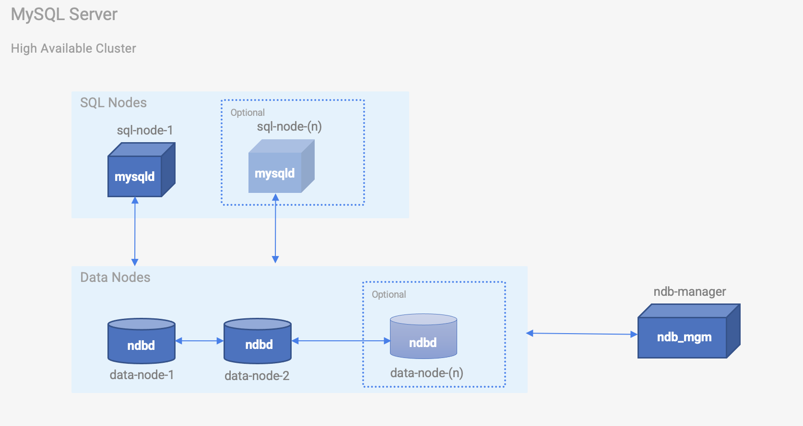

# MySQL Cluster PoC

This repository, `mysql-cluster-poc`, contains a Docker Compose setup and all necessary configuration files to run a local MySQL Cluster using the NDB storage engine. This setup is designed for testing the MySQL partitioning feature and serves as a proof-of-concept for a highly available MySQL Cluster architecture.



## Prerequisites

To run the MySQL Cluster PoC, you need the following installed on your system:

- Docker
- Docker Compose

## Getting Started

To set up and run the local MySQL Cluster, follow these steps:

1. Clone the `mysql-cluster-poc` repository:

   ```
   git clone https://github.com/your_username/mysql-cluster-poc.git
   ```

2. Change your working directory to the `mysql-cluster-poc` folder:

   ```
   cd mysql-cluster-poc
   ```

3. Run the MySQL Cluster using Docker Compose:

   ```
   docker-compose -f docker-compose.yml up
   ```


   

4. Once the MySQL Cluster is up and running, you can connect to the SQL node using the exposed port 3306 and start testing the partitioning feature.

## Exploring MySQL Partitioning

After setting up the MySQL Cluster PoC, you can use the various types of table partitions available in MySQL to optimize data management and query performance. Refer to this [blog post](link_to_blog_post) for an in-depth explanation of MySQL table partitioning types and examples.

## Stopping and Cleaning Up

When you're done testing the MySQL partitioning feature, you can stop and remove the Docker containers by running the following command:

```
docker-compose down
```


This will stop and remove all containers associated with the MySQL Cluster PoC.

For further information or assistance, feel free to contact me directly alex@datatogo.uk.
